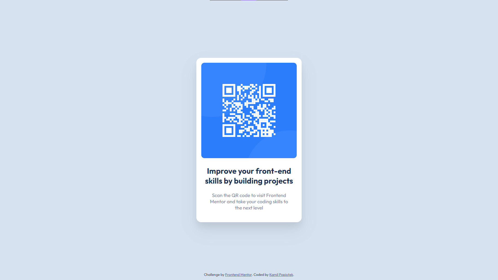

# Frontend Mentor - QR code component solution

This is a solution to the [QR code component challenge on Frontend Mentor](https://www.frontendmentor.io/challenges/qr-code-component-iux_sIO_H). Frontend Mentor challenges help you improve your coding skills by building realistic projects.

## Table of contents

- [Overview](#overview)
  - [Screenshot](#screenshot)
  - [Links](#links)
- [My process](#my-process)
  - [Built with](#built-with)
  - [What I learned](#what-i-learned)
- [Author](#author)

## Overview

### Screenshot

### Links

- Solution URL: [Github repo](https://github.com/itzL1m4k/qr-code-component-main)
- Live Site URL: [Live webstite](https://qr-code-component-itzl1m4k.vercel.app/)

## My process

### Built with

- Semantic HTML5 markup
- CSS custom properties
- Flexbox

### What I learned

I learned that this project was relatively easy because I already knew how to do it without much difficulty.

## Author

- Website - [Kamil Popiołek](https://github.com/itzL1m4k)
- Frontend Mentor - [@itzL1m4k](https://www.frontendmentor.io/profile/itzL1m4k)
